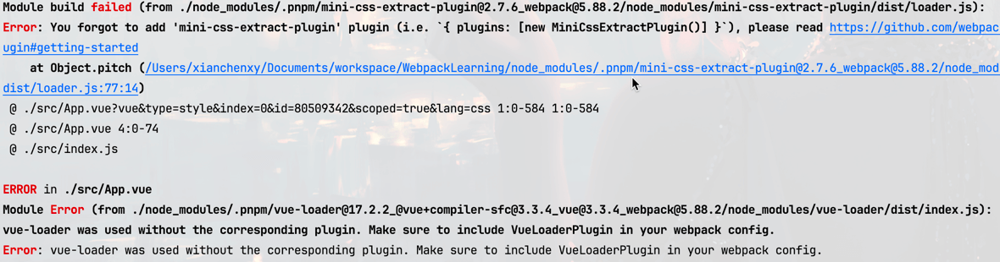

After we import and use `speed-measure-webpack-plugin` plugin, we build 
```js
const SpeedMeasurePlugin = require('speed-measure-webpack-plugin');
const smp = new SpeedMeasurePlugin();
module.exports = smp.wrap(webpackConfig);
```
an error occurred

See it lost plugins!!!

After searching issues in `speed-measure-webpack-plugin`, i found that
https://github.com/stephencookdev/speed-measure-webpack-plugin/issues/167#issuecomment-1461139945

OK,here is our webpack-plugin list
```js
plugins: [
	new webpack.ProgressPlugin(),
	new CleanWebpackPlugin(),
	...multiplePages.htmlWebpackPlugin,
	new MiniCssExtractPlugin({
		filename: '[name].[contenthash:8].css',
		chunkFilename: '[id].[contenthash:8].css'
	}),
	new VueLoaderPlugin()
]
```

we can get config origin plugin object previously.
```js
const cssPluginIndex = webpackConfig.plugins.findIndex(e => e.constructor.name === 'MiniCssExtractPlugin');
const cssPlugin = webpackConfig.plugins[cssPluginIndex];
// const {VueLoaderPlugin} = require('vue-loader');
// VueLoaderPlugin's contructor is Plugin(maybe it'll be change?)
const vueLoaderPluginIndex = webpackConfig.plugins.findIndex(e => e.constructor.name === 'Plugin'); 
const vueLoaderPlugin = webpackConfig.plugins[vueLoaderPluginIndex];
```
then got the object return by `speed-measure-webpack-plugin`.
Replace with origin object finally.
```js
const SpeedMeasurePlugin = require('speed-measure-webpack-plugin');
const smp = new SpeedMeasurePlugin();

const configToExport = smp.wrap(webpackConfig);
configToExport.plugins[cssPluginIndex] = cssPlugin;
configToExport.plugins[vueLoaderPluginIndex] = vueLoaderPlugin;
module.exports = configToExport;
```
try agin `npm run build`. It works now.
